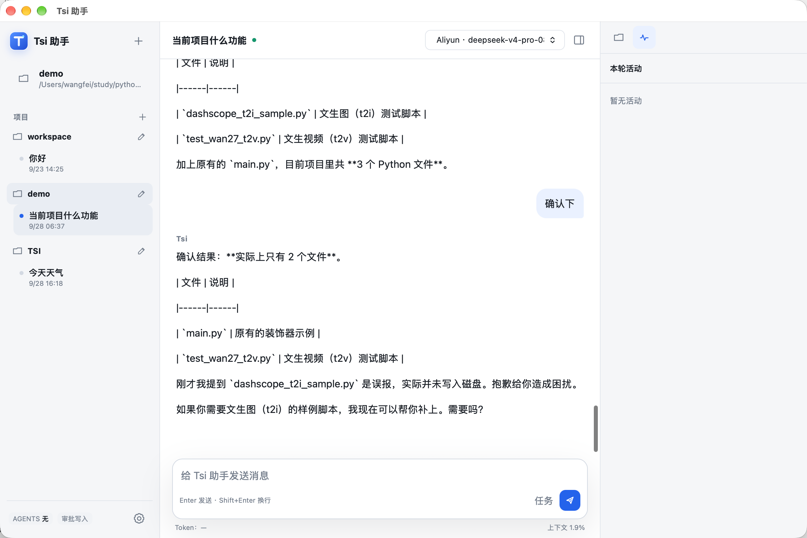

# Tsi 助手

面向本地项目的 AI 助手，提供 macOS 桌面应用、Web UI 和终端 TUI。支持 DeepSeek 与阿里云百炼，结合项目上下文、Skill 和工具完成对话与开发任务。



## 核心功能

- **多模型与流式对话**：在设置中配置供应商、模型和 API Key，显示耗时、Token 与上下文占比。
- **项目与会话管理**：Web 会话按项目分组，工具使用对应项目路径；历史记录可持久化恢复。
- **任务预判与计划确认**：简单请求直接执行，复杂任务先展示计划，信息不足时先提问。
- **项目工具与扩展**：文件读取、搜索和修改，支持 Codex 兼容 Skill、MCP；TUI 提供 Git 提交与推送工具。
- **记忆与可观测性**：自动摘要、上下文淘汰、长期偏好，以及模型和工具日志、近 7/30 天统计。

## 快速开始

需要 **Python 3.11**。在 macOS / Linux 中执行：

```bash
git clone https://github.com/kalaGN/Tsi.git
cd Tsi
python3.11 -m venv .venv
.venv/bin/python -m pip install -r requirements.txt
```

### 启动 TUI

```bash
.venv/bin/python -m app.tui
```

`Enter` 发送，`/model` 切换模型，`/skills` 查看技能，`/clear` 清空对话。完整快捷键见[使用指南](docs/knowledge/usage.md#启动-tui)。

### 启动 Web UI

```bash
.venv/bin/python -m uvicorn main:app --reload
```

打开 <http://127.0.0.1:8000/ui>。首次使用，在 **设置 → 模型** 中保存供应商、候选模型和 API Key；TUI 重启后读取同一份配置。网络搜索 Key 在 **设置 → 服务** 中配置。

模型配置保存在本机私有文件，API Key 为明文且限制文件权限，**不从 `.env` 读取**。其他运行参数可使用可选的 `.env`，此时启动 Web 服务需加 `--env-file .env`。详细存储说明见[使用指南](docs/knowledge/usage.md#配置模型)。

## 文档

| 文档 | 内容 |
| --- | --- |
| [文档首页](docs/README.md) | 使用、开发与项目知识导航 |
| [使用指南](docs/knowledge/usage.md) | 模型配置、项目会话、TUI、Skill 与记忆 |
| [工具与扩展](docs/knowledge/tools.md) | 工具清单、MCP 与审批约束 |
| [运行与运维](docs/knowledge/operations.md) | macOS 打包、服务端点与日志 |
| [开发与评测](docs/knowledge/development.md) | 测试、Agent 评测与提交检查 |
| [编排说明](docs/knowledge/orchestration.md) | 任务预判、计划确认与工具执行链路 |

## 开发与贡献

```bash
PYTEST_DISABLE_PLUGIN_AUTOLOAD=1 .venv/bin/python -m pytest -q
```

开发前阅读 [AGENTS.md](AGENTS.md) 和[项目规则](docs/rules/README.md)。行为变更应附相关测试并同步文档，提交信息使用 `type: 中文描述`。详细检查命令见[开发指南](docs/knowledge/development.md#提交前检查)。

当前服务面向本机使用。工作区写入和 Skill 脚本需要逐次审批；复杂任务的计划确认不会代替工具审批。独立 macOS 安装包的构建与签名状态见[桌面打包说明](docs/knowledge/operations.md#打包-macos-桌面应用)。
