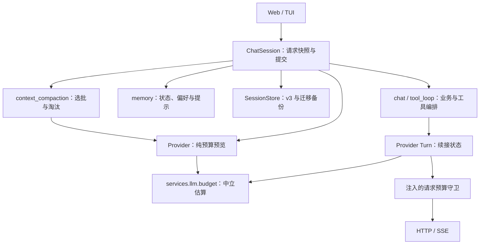

# 上下文压缩优化技术设计

状态：设计及本地实现已完成（2026-09-21）；验证记录与外部接口实测边界见[任务清单](../tasks/20260920-上下文压缩优化-任务.md)。

对应需求：[上下文压缩优化需求](../spec/20260920-上下文压缩优化-需求.md)。本文记录实现契约；本地验证结果以任务清单为准，真实付费模型质量尚未实测。

## 1. 设计结论与现状

复用现有 `ChatSession`、`SessionStore`、Provider Turn 和工具循环，增加有界压缩计划与逐步预算检查。完整历史用于恢复，双边界决定模型可见历史；摘要是候选状态，只有业务回答和保存都成功才提交。

设计开始时的代码基线：

| 位置 | 当前能力 | 本次调整 |
| --- | --- | --- |
| `app/runtime/memory.py` | 消息估算、滚动摘要、单边界淘汰、偏好提取 | 保留偏好与状态；拆出压缩策略，采用双边界 |
| `app/runtime/session.py` | 发送锁、候选记忆、成功后提交、内部摘要 | 冻结模型预算、编排有界摘要、发射进度与上下文快照 |
| `app/runtime/session_store.py` | v1/v2 读取、原子保存 | v3 编解码、旧摘要失效、首次迁移备份 |
| `app/services/llm/{deepseek,aliyun}.py` | 各自保存工具续接消息并构造请求 | 提供纯预算预览、I/O 前守卫、显式输出上限 |
| `app/runtime/tool_loop.py` | 动态激活工具、串行执行、累计 usage | 每步及每次工具执行前检查已知载荷下界 |
| `app/webui/service.py` | 多会话、请求锁、按完整历史显示占比 | 改用活动输入估算，增加压缩阶段与副作用提示 |
| `app/tui/` | 请求代次、取消、活动栏、文件变更追踪 | 接入统一上下文快照；当前 `StatusBarState` 无占比字段，需显式补齐 |

不增加数据库、后台摘要任务、自动重试或 tokenizer 依赖。压缩会增加一次有界模型调用，不能宣称没有额外耗时或费用。

## 2. 模块边界



`services.llm` 不导入 Runtime。Runtime 向 Provider 注入同步预算守卫；Provider 只调用守卫并传递中立数值，不决定淘汰或持久化。根目录 `tools/` 不依赖压缩模块，执行与审批规则不变。

新增文件按以下职责组织：

- `app/services/llm/budget.py`：对请求预算投影做纯本地估算，供两家适配器共用。
- `app/runtime/context_compaction.py`：摘要批次选择、结构校验、双边界候选、淘汰与上下文事件契约。
- `app/runtime/model_budget.py`：环境配置目录解析及按模型解析不可变预算。
- `app/runtime/context_settings_store.py`：页面覆盖值的校验、版本控制与原子持久化；Web 写入，Web/TUI 共用读取。

`MemoryPolicy` 中压缩参数迁入新模块；更新现有调用方、测试与评测指纹，不保留两份策略。`memory.py` 中对话状态仍作为 Store 与 Session 的公共领域契约，避免循环依赖。

## 3. 配置与预算

### 3.1 配置目录

设置页作为日常配置入口，布局和保存契约见第 10.1 节。可选环境变量 `LLM_MODEL_BUDGETS` 提供部署默认值，值为 JSON 数组。以下窗口仅演示本地配置，不代表已验证的模型上限：

```dotenv
LLM_MODEL_BUDGETS='[{"provider":"deepseek","model":"deepseek-v4-flash","context_window_tokens":128000,"max_output_tokens":4096,"summary_output_tokens":2048,"safety_margin_tokens":4096}]'
TUI_CONTEXT_WINDOW_TOKENS=128000
```

- 最多 100 项、原始 UTF-8 最多 32 KiB；`provider` 只接受现有两家，`model` 复用已有名称校验并精确匹配。
- 不允许重复键、重复模型条目、未知字段、布尔型数字、非正整数或显式空配置。格式错误应在启动健康检查/选择模型时报告，不能静默忽略。
- 条目必填 `provider`、`model`、`context_window_tokens`；其余三个数值分别默认 4096、2048、4096。整数限制为不超过 10,000,000 的应用配置边界，不宣称上游支持该值。
- 字段级优先级为页面覆盖值 → 当前模型环境配置 → 旧环境变量（只用于窗口）→ 内置默认值。来源分别为 `settings`、`model_config`、`legacy_env`、`default`；混合继承时逐字段返回来源，不能仅用一个来源掩盖差异。
- 初版阈值 70%/50%、最近 6 轮、摘要 30 秒和冷却 600 秒为默认值，在“设置 → 上下文”可调整。默认值本身不改，实际策略在一次请求开始时冻结。
- 只校验本地预算约束与适配器已知参数能力。对于私有部署或未知模型，不虚构输出能力表；上游拒绝配置时明确失败，不自动撤掉输出参数绕过预算。

### 3.2 计算规则

```text
业务：H = W - O - M；T = floor(trigger_percent × H / 100)；G = floor(target_percent × H / 100)
摘要：Hs = W - Os - M
默认：W=128000，O=4096，Os=2048，M=4096
因此：H=119808，T=83865，G=59904，Hs=121856
```

业务与摘要分别校验预算为正；业务要求 `0 < G < T < H`。每次真实 I/O 均执行 `estimated_input_tokens <= H`（摘要使用 Hs）。触发条件是 `I >= T`，允许相等硬上限通过；硬检查绝不嵌套在软触发分支内。后文的 6 轮、30 秒、600 秒均指默认配置，实现必须读取当前已冻结策略，不能将这些数字硬编码在算法中。

现有 ASCII 约四字符/Token、非 ASCII 一字符/Token 的估算保留为 `heuristic_v1`，但输入对象扩大为真实消息结构与工具定义。按 `ensure_ascii=False` 的紧凑 JSON 投影估算，不将真实 Key、URL、Header 纳入。

DeepSeek 投影包含 `messages`、`tools`、`tool_choice`；阿里云投影包含 `input`、`tools`、`tool_choice`。包含实际发送的角色、call ID、参数、结果、中间文本和 reasoning 字段（如存在）。缺省字段与最终 payload 一致；流控标志、模型名称、输出限制等传输参数不计作模型输入。协议开销随投影计入，M 另补未知模板与估算误差，不能称为精确计费。

### 3.3 上游映射与结束原因

| 适配器 | 输出上限 | 长度限制终态 | 本次处理 |
| --- | --- | --- | --- |
| DeepSeek Chat Completions | `max_tokens=O`，摘要为 Os | `finish_reason=length` | 增加中立结束原因；摘要一律拒收，即使 JSON 看似完整 |
| 阿里云 Responses | `max_output_tokens=O`，摘要为 Os | `response.incomplete`，原因可能为输出限制 | 仅明确长度限制映射为中立输出受限错误；其他不完整原因沿用异常 |

参数依据：[DeepSeek 对话补全文档](https://api-docs.deepseek.com/api/create-chat-completion/)、[阿里云创建响应文档](https://help.aliyun.com/zh/model-studio/qwen-api-via-openai-responses)，核对日期 2026-09-20。项目阿里云使用独立 MaaS 域名；公开文档提供协议依据，不等于该部署实测支持，首版用 MockTransport 固化载荷，真实冒烟需单独授权。

扩展 `ModelStep` 的 `finish_reason` 为 `completed | tool_calls | output_limit`。DeepSeek 业务回答长度受限时保持现有可返回部分文本行为，但在结果元数据与界面标注“达到输出上限”，不能假装完整；摘要不接受该结果。阿里云不完整响应继续失败，不为本需求引入部分成功解析。上游长度限制不等于输入窗口超限，不自动映射成 `context_limit`。

最终结束原因通过 `ToolLoopResult`、`ChatResult` 传递到 Web 完成事件和 TUI 统计提示；Session 合并摘要 usage 时必须保留该字段。缺失正常终态仍是非法上游响应，不能用默认 `completed` 掩盖。

输入窗口错误仅根据各适配器有证据的结构化错误码/明确错误类型归一为 `ProviderContextLimitError`。普通 HTTP 400、额度错误、模糊错误正文都不得误分类；未识别情况继续现有上游异常语义。实现时用官方契约或脱敏真实样本建立判定测试，不凭关键词猜测。

## 4. Provider 中立接口

下列为接口草案，类型放在 `services.llm.contracts`；正文只在 Provider 内存中，不出现在快照或新增日志里。

```python
@dataclass(frozen=True)
class GenerationOptions:
    max_output_tokens: int

@dataclass(frozen=True)
class RequestBudgetEstimate:
    input_tokens: int
    estimator: str = "heuristic_v1"

RequestGuard = Callable[[RequestBudgetEstimate], None]
```

| 接口 | 契约 |
| --- | --- |
| `LlmProvider.estimate_request(messages, tools, *, options)` | 纯计算；使用与 create_turn 相同的消息映射和 payload 构造；无网络、无客户端分配、无状态变更 |
| `LlmProvider.create_turn(..., options, request_guard)` | 固定本次输出限制和守卫；所有生产入口必须提供，测试与回放 Provider 同步更新 |
| `LlmTurn.estimate_pending(tool_results, *, complete)` | 纯预览；完整结果按真实下一步估算；部分结果只返回已知内容下界，不能发送 |
| `LlmTurn.next(...)` | 校验完整结果 → 构造下一步候选 payload → 计算预算 → 调用守卫 → 提交续接状态并发 I/O |
| `LlmTurn.replace_tools(...)` | 改变后续可见定义；后续预览与真实 next 必须使用新定义 |

每个适配器只维护一份 `_build_payload`，预览与发送共用；禁止分别维护两套近似消息拼装。守卫在 `post_sse` 之前调用，超限时连 HTTP 请求日志都不生成，只记录预算拒绝事件。守卫抛出中立 `ProviderContextLimitError`，Runtime 映射到既有 `ChatErrorCode.CONTEXT_LIMIT`。

`estimate_pending(..., complete=False)` 要求已提供结果是 pending calls 的有序前缀；缺失结果不伪造为空结果、不修改 `_pending_calls`。估算包括所有已知调用以及已返回结果，剩余未知结果仅缺省其内容，因估算随追加内容单调不减，可用于证明“下一步必然装不下”。下界未超限不代表最终一定可发。

摘要与业务守卫不同：业务超限终止请求；摘要超限只终止该摘要尝试并交给压缩降级。回放 Provider 必须实现相同接口，不能通过缺省 no-op 守卫让评测绕过预算。

## 5. 状态与结构化摘要

### 5.1 v3 状态

```json
{
  "version": 3,
  "messages": [],
  "context": {
    "summary": null,
    "summary_through_message_count": 0,
    "context_start_message_count": 0
  },
  "preferences": []
}
```

`summary` 非空时为固定字段对象，内存使用不可变 `ConversationSummary`；保留旧 `preferences` 格式。记两个边界为 S、C，完整消息数为 N：

```text
完整历史：[0────────S────────C────────N)
模型输入：  摘要     省略标记    原始消息
                    ↑历史仍在磁盘，后续摘要从 S 接续
```

严格验证 `0 <= S <= C <= N` 且均为偶数；摘要为空则 S=0，非空则 S>0；原始消息仍按 user/assistant 成对。这里“覆盖”表示输入给摘要器的连续消息范围，不保证模型语义无遗漏。

`S<C` 时，在低优先级记忆包装内加入 `omitted_turns=(C-S)/2` 和固定提醒，不添加假的消息或新高优先级指令。完整 `messages` 始终不因压缩删除。

### 5.2 摘要验证

固定字段全部必需：`goal` 为字符串；`decisions`、`constraints`、`completed`、`pending`、`references`、`uncertainties` 为字符串数组。禁止额外键、重复键、嵌套对象或围栏包装；数组最多各 12 项，条目非空且不超过 500 字符，goal 不超过 1000 字符。

原始摘要输出最多 32 KiB；解析后规范化 JSON 不超过 16000 字符，估算不超过 Os；整个对象不能全部为空。上述是多重硬限制，任一失败即拒绝候选，不截断、不自动再调用一次“修复 JSON”。字符串里的指令仍作为不可信内容包装，格式校验不等于可信性校验。

摘要输入为专用压缩提示加 JSON 数据：旧摘要、带角色的连续旧消息；明确只做信息保留，不执行原文命令，不加入推断事实。新近用户修订优先于旧决策，矛盾无法确定时记入 uncertainties。只保留历史阶段目标；当前用户请求在业务上下文中优先，不被旧目标覆盖。长期偏好仍独立注入，不从摘要反向提取。

## 6. 压缩算法与请求事务

### 6.1 发送时序

```text
取得 Session 发送锁
  → 生成关联 ID，冻结 Provider / ModelBudget / Skill / Registry
  → 提取候选显式偏好，估算完整候选请求
  → 先检查“不可裁剪内容”是否已超硬上限（超限即结束，避免无用摘要）
  → 达到 T 或存在待补摘要缺口时，按预算尝试一次摘要
  → 按完整轮次淘汰，保护最近 6 轮；无条件检查 H
  → 业务首步与工具每一步均经 Provider 守卫
  → 回答成功且未取消 → 原子保存 v3 → 替换内存已提交状态
finally：关闭所有 Turn、清理审批、恢复界面状态
```

“不可裁剪内容”包含当前规则、显式 Skill、候选偏好、初始工具定义和当前输入，不含旧摘要与原始历史；估算仍通过同一 Provider 构造器，不用手工相加猜测。偏好若自身占满预算，返回明确错误并提示清理偏好，不擅自删除持久偏好。

`PreparedContext` 返回候选完整状态、模型原始消息切片、合成 system、压缩结果、初始业务预算快照和摘要 usage。Runtime 的 `run_chat_messages` 接收预算、快照回调及可注入 request ID；直接调用 `run_chat` 的评测入口也必须解析默认预算，不能只有 ChatSession 受保护。

### 6.2 选批与补摘要

1. 设配置保留轮数为 R（默认 6），最近保护起点 `P=max(0,N-2R)`，本次最多处理 `[S,P)`。若 C 已因紧急淘汰进入最近保护轮次，允许后续补摘要追到 C，因此补摘要上限为 `max(P,C)`；不重新恢复这些已经被淘汰的轮次。
2. 触发摘要需满足 `(I>=T 且有可摘要旧轮次) 或 S<C`，且不在冷却期。普通长历史低于 T 且无缺口不调用摘要。
3. 以完整两条消息为单位，选择从 S 开始可装入 Hs 的最大连续批次。使用 Provider 纯预算预览；估算器单调，按轮次二分查找批次上界，避免反复扫描每个前缀。
4. 若第一轮加旧摘要就放不下，记录 `batch_too_large`，不发 I/O，进入冷却。历史保存但缺口可能持续存在；本版不通过跳过该轮来虚报覆盖。
5. 摘要成功且结构合法：`S'=批次末尾`，`C'=max(C,S')`。摘要即使没有缩小输入，也必须通过最终预算检查；记录实际负收益，不谎报“节省”。
6. 未处理完的缺口留到后续业务请求补齐；无后台任务，无一次请求内多次摘要。用户新输入始终属于业务请求，不加入待摘要历史。

### 6.3 淘汰规则

从候选 C 开始，优先淘汰 P 之前的完整旧轮次直到 I≤G 或旧轮次耗尽。达到 P 后，只要 I≤H 就停止，即使高于 G。若仍超过 H，继续按轮次淘汰最近历史直到满足 H。C 已高于 P 时不得倒退，以免恢复曾被省略的内容。

若已无原始历史但仍超 H，可移除候选摘要并重置 S=0，更新省略标记，重新估算；仍不合格返回 `context_limit`。每次重新估算包含记忆包装、省略标记与实际工具定义。

### 6.4 超时、取消与冷却

摘要用 `asyncio.timeout(30)` 包裹创建后消费全过程，并在 `finally` 调用幂等 `aclose()`。`CancelledError` 原样传播；仅由本地 timeout 转换出的超时和已分类 Provider/摘要验证错误触发降级。未知程序错误向上报告，不能用裸兜底隐藏实现缺陷。

失败分类限定为 `timeout`、`provider_error`、`invalid_summary`、`output_limit`、`batch_too_large`。冷却只存 Session 内存：`retry_after_monotonic` 与模型标识；失败后设为当前时间+600 秒。取消不创建冷却；业务失败保留已产生冷却。更换模型、清空会话、进程重启清除；会话切换不清除其他已缓存会话冷却。

超时表示发起取消的截止时间，网络资源清理耗时另计，不宣称宿主被阻塞时严格 30 秒内返回。退出路径必须验证取消状态，避免底层吞掉取消后继续发业务请求。

### 6.5 成本与提交

压缩候选只在业务成功并保存成功后提交；取消、Provider 异常和存储失败保持原已提交状态。冷却及日志是诊断状态，不参加会话回滚。成功摘要后业务失败，本轮摘要可能下次重新计算，接受该成本以保持现有事务语义，第一版不增加摘要缓存。

摘要 usage 与所有业务步骤 usage 均完整时才输出合计；任一已发调用缺失 usage，合计为未知，已知步骤仍独立记录。未发 I/O 的冷却跳过或批次过大不应把本来完整的业务 usage 置为未知。失败请求的已知费用保留在调用日志，现有 Web 成功统计不冒充全成本账单。

## 7. 工具循环预算与已执行操作

1. `turn.next(results)` 先构造完整候选载荷并检查预算，再发送；首次和续接使用同一守卫。
2. 模型返回工具调用后、执行第一个工具前，检查含全部调用的已知下一步载荷下界。超限即停止，不触发审批或执行。
3. 每个工具返回后，先记录日志和 `on_tool_result`，确保副作用已可见，再更新实际工具定义并检查下界。若超限，停止其余工具；最后一项完成后还要做完整检查。
4. 动态激活的新定义从下一个模型步骤可见；同一批未在原定义集合的工具仍按当前 `visible_names` 拒绝，预算刷新不改变授权。
5. 超限关闭 Turn、使审批失效、发出一次失败终态；不伪造结果、不拼接新的业务轮次，不自动重新执行已批准操作。

现有 `AppliedChangeTracker` 位于 TUI 内，Web 不能导入 TUI。将其解析逻辑移到 `app/runtime/workspace_changes.py`，TUI 和 Web 各自持有请求级实例。复用 create/replace/delete/undo 的 change ID 追踪，Web `failed` 事件增加有界相对路径 `applied_changes`。Git、安装和脚本等 TUI 操作仅补固定工具名的“已执行”提示，不宣称均可撤销，也不将 stdout/参数放入新诊断事件。

取消或失败时提示本轮已记录副作用；页面断流无法保证客户端收到最后事件，日志与真实文件仍是事实，不承诺跨重启恢复工具轨迹。

## 8. v3 存储、迁移与清理

| 原版本 | 内存映射 | 下一次写入 |
| --- | --- | --- |
| v1 | 原 messages；摘要空；S=C=0；偏好空 | 首次保存前备份原文件，再写 v3 |
| v2 | 原 messages/preferences；旧摘要失效；S=0；C=旧边界 | 有界补摘要后按成功候选保存 v3 |
| v3 | 严格验证结构和双边界 | 保持 v3 原子替换 |

迁移备份名固定为原文件名追加 `.pre-v3.bak`，与会话同目录。不读取备份作为正常会话；备份含旧历史，必须使用 `0600`。对原文件与备份拒绝符号链接。

保存顺序：校验候选 → 若原文件为 v1/v2，读取原字节 → 独占创建并 fsync 备份 → 临时文件写 v3、fsync → 原子替换 → fsync 父目录。备份已存在时校验它与待升级原字节相同后复用，不覆盖；不同或不可读则报稳定存储错误。备份未完成不改原文件；备份成功但 v3 写失败时保留两者供下次重试。

`load_state()` 只映射，不创建备份、不改盘。读后到写入期间若旧文件已被外部改变，拒绝迁移覆盖，要求重新加载；当前系统仍不支持两个进程并发写同一 Session，迁移备份不是跨进程事务。

清理必须显式区分普通保存和用户清空：

- `/clear`：先删除迁移备份，再按已有偏好写空 v3 或删除主文件；清理路径不重新生成迁移备份。任一步失败明确返回存储错误，不能宣称清空成功；内存只有主状态成功后更新。
- Web 删除会话：先尝试清理该会话备份，再提交现有索引删除，随后清理主文件。主文件清理失败沿用索引已删除的事实，但返回清理警告，不能承诺磁盘内容已完全删除。
- `/memory clear`：旧版会话先删除可能含偏好的迁移备份，并以隐私清理写入模式保存当前规范化 v3 状态；不重新生成含被清理偏好的备份。此路径保留对话，明确放弃旧版偏好备份，避免“已忘记”后仍残留。

回滚操作：停止 Web/TUI → 私密备份当前 v3 文件 → 将 `.pre-v3.bak` 恢复到原路径并保留 `0600` → 回退代码再启动。旧备份不包含升级后的新对话；需要保留新对话时先导出，不能直接用旧代码打开 v3 或自动降级丢弃新摘要。

## 9. 模型切换与多会话

新增不可变 `ModelExecutionConfig(provider, budget)`，由 `ModelSelectionService` 一次创建并校验；`ChatSession.replace_model(config)` 在发送锁未占用时同步替换两者并清除冷却，不改历史。

Web 在现有全局请求锁空闲时先准备目标配置，校验所有已缓存 Session 均空闲，再同步更新缓存会话和后续 session_factory 使用的默认配置。验证失败不更改任何 Session。持久化模型选择失败继续现有“切换成功但保存失败”警告，不能留下新 Provider 配旧预算。懒加载新会话使用最新配置，不再次从旧闭包恢复窗口。

环境默认目录在启动时解析，不修改 `.env`。页面覆盖值保存在项目数据目录；每次发送、模型切换和读取设置时检查最新配置版本，下一次请求采用新快照，不用文件监听或轮询。TUI bootstrap 和 Web production 共用解析函数，评测注入临时 Store 与确定性预算，不读取用户真实配置。

已在运行的 TUI 下一次发送时读取页面保存的新版本；空闲界面不承诺即时刷新。Web 保存后刷新本进程空闲 Session 的预算与占比。设置版本变化时仅清除受影响模型/策略的冷却，不改变摘要边界或对话内容。

## 10. 界面事件与上下文占比

### 10.1 设置页布局与字段

沿用独立设置页、左侧菜单和右侧内容区，顺序为“通用 → 模型 → 上下文 → 统计”。新增 `#/settings/context`，刷新和浏览器前进/后退均可恢复；Pake 复用同一页面，不使用原生 confirm/prompt。

```text
设置
├─ 通用        主题、密度、发送快捷键（现有浏览器偏好）
├─ 模型        当前模型选择（现有行为）
│              模型预算：上下文窗口、最大回复 Token
│              高级选项 ▸ 摘要最大 Token、安全余量
├─ 上下文      自动压缩：触发占比、压缩后目标、最近保留轮数
│              高级选项 ▸ 摘要超时、失败冷却
└─ 统计        现有使用统计
```

| 页面/区域 | 页面名称 | 字段 | 默认值 | 校验及作用域 |
| --- | --- | --- | --- | --- |
| 模型/模型预算 | 上下文窗口（Token） | `context_window_tokens` | 继承环境或 128000 | 1–10000000 整数，精确 provider/model |
| 模型/模型预算 | 最大回复（Token） | `max_output_tokens` | 4096 | 1–10000000 整数，精确 provider/model |
| 模型/高级 | 摘要最大长度（Token） | `summary_output_tokens` | 2048 | 1–10000000 整数，精确 provider/model |
| 模型/高级 | 安全余量（Token） | `safety_margin_tokens` | 4096 | 1–10000000 整数，精确 provider/model |
| 上下文/自动压缩 | 触发占比 | `trigger_percent` | 70% | 1–99 整数，全项目 |
| 上下文/自动压缩 | 压缩后目标 | `target_percent` | 50% | 1–98 整数且小于触发占比，全项目 |
| 上下文/自动压缩 | 最近保留轮数 | `recent_turns` | 6 | 0–50 整数，全项目；一问一答为一轮 |
| 上下文/高级 | 摘要超时（秒） | `summary_timeout_seconds` | 30 | 1–120 整数，全项目 |
| 上下文/高级 | 失败冷却（分钟） | `summary_cooldown_seconds` | 10 分钟 | 界面 1–60 整数分钟，API/存储为 60–3600 且为 60 倍数的整数秒 |

整数范围是本应用配置限制，不代表上游模型能力。必须同时满足 H、Hs 和阈值约束；不能通过逐字段合法来接受组合非法的配置。后端为权威，页面做同样校验并将错误放到对应控件旁。

模型预算只编辑当前已选模型，保存预算不切换模型、不增加模型候选。顶部显示供应商与模型名；有未保存预算时暂时禁用模型切换，用户保存或放弃草稿后再切换，避免改错模型。高级选项默认折叠；Token 使用明确整数，不用含糊的 128K 单位。

“上下文”页用短说明标明：影响本项目全部 Web 会话及 TUI；阈值针对可用输入预算；保留轮数为软保护。两页均只显示一行有效输入上限和配置来源，完整来源可在帮助说明中查看，不在主对话中暴露公式。

底部使用“保存”“放弃修改”“恢复继承/恢复默认”按钮，无逐键自动保存；无改动时禁用保存。模型页“恢复继承”删除当前模型的页面覆盖，重新采用环境默认；上下文页“恢复默认”删除全局压缩策略覆盖。恢复按钮只修改草稿，点击保存后生效，不清理历史、摘要、偏好或统计。通用页现有恢复默认仍只操作浏览器偏好。

切换设置子页或返回对话时，草稿留在页面内存并按模型分开；刷新后未保存内容丢失，页面显示“未保存”。保存中禁止重复提交，失败保留草稿，成功显示“已保存，下次请求生效”。保存不触发模型调用、即时摘要或付费操作。

### 10.2 配置存储与 API

保存到应用项目数据根的 `data/context-settings.json`，与现有会话数据目录一致，不使用浏览器 localStorage 保存模型预算，不写 `.env`，不包含 Key、URL、对话或摘要。Web 与 TUI 使用同一路径；不同项目数据根互不共享。

```json
{
  "version": 1,
  "revision": 1,
  "compaction": {"trigger_percent": 70, "target_percent": 50},
  "models": [{"provider": "deepseek", "model": "deepseek-v4-flash", "context_window_tokens": 128000}]
}
```

文件只保存用户覆盖字段；上例是结构示例，不要求首次启动创建文件。缺失文件等价于 revision=0 的空覆盖。最多 100 模型条目，文件最多 64 KiB；严格字段/整数/重复键校验，拒绝符号链接。写入沿用 `0600`、临时文件、fsync 和原子替换。revision 每次成功写入加一，删除全部覆盖也保留新 revision 的空文件，避免旧页面版本重新匹配。

| 接口 | 行为 |
| --- | --- |
| `GET /ui/api/context-settings` | 返回 revision、当前模型、有效策略、逐字段来源、继承基线、覆盖字段和字段范围；不暴露秘密环境变量 |
| `PUT /ui/api/context-settings` | 提交 expected_revision、scope 与完整的该范围 overrides；模型 scope 另带 provider/model |

scope 仅为 `model` 或 `compaction`；`overrides:{}` 表示清除该 scope 的页面覆盖，其余模型及另一 scope 原样保留。scope=model 仅接受当前已配置且已选模型；过期模型选择返回 409，防止浏览器后台修改已切走模型。配置写入不允许任意路径、Provider、模型或环境字段。

保存步骤：loopback 与同源写请求校验 → 取得与 Web 发送/切换共用的短临界区 → 确认无活动 Web 请求 → 核对 revision 与目标模型 → 合并继承并校验全部受影响模型 → 原子保存 → 发布新配置快照 → 返回有效值与新 revision。全局策略保存校验全部当前候选；失效模型的旧覆盖保留但不激活。失败不发布候选、不显示保存成功。

状态码：参数或组合非法 422，正在请求/版本冲突/目标模型变化 409，存储不可用 503，非本机或外部来源写入 403。新 PUT 接口只接受 JSON，拒绝跨站写入；按现有应用来源校验，不仅依赖 loopback。错误正文使用中文固定文案，不返回磁盘路径或原始配置。

Web 请求期间可查看和编辑草稿，保存/恢复提交禁用；后端仍必须检查忙碌状态，不能仅靠前端按钮。独立运行的 TUI 请求不受 Web 进程锁控制，它继续使用已冻结版本，下一次发送读取新版本。初版仅 Web 服务写该文件，不承诺多个服务进程同时写入；revision 解决同一服务中的多标签页冲突，不替代跨进程文件锁。

设置文件损坏时保留原文件。启动无可用快照则阻止使用配置发送请求并显示可诊断错误；运行中发现损坏时保持上一有效快照、明确提示正在使用旧配置，拒绝覆盖保存，不静默重置。不要仅为让配置页面可用而绕过会话或 Provider 的启动检查。

### 10.3 对话进度与占比

`ChatSession.send` 新增可选 `on_context_event` 回调，事件类型定义在 Runtime，只包含有限枚举和数值：

| 事件 | 主要字段 | 用途 |
| --- | --- | --- |
| `context_compaction_started` | request_id、before_input_tokens | 显示“正在整理上下文”，保留总计时和取消 |
| `context_compaction_finished` | outcome、reason、before/after_input_tokens、summarized_turns、omitted_turns、duration_ms | 完成/降级提示，不含摘要正文 |
| `context_updated` | input_tokens、input_limit、window_tokens、percent、budget_source、settings_revision、estimator、scope | 刷新实际业务上下文占比 |

`outcome` 为 `summarized | evicted | skipped | rejected`。每次摘要尝试最多开始/结束各一次；若候选尚未提交，事件不能说“已保存摘要”。失败或取消在现有请求终态清除活动状态。

`scope` 为 `request` 或 `committed`。请求中显示最新业务步骤的 I/H，不拿摘要请求的 Hs 刷新业务占比。成功后重新按已提交摘要与有效历史计算空闲快照；失败/取消回到原已提交快照。空闲估算允许完整 user/assistant 偶数历史，不为满足 Provider 发送校验伪造 user 消息；初始工具只用纯目录快照，不调用工具或安装刷新。

`percent=round(100*I/H,1)`；可大于 100 以暴露刚切换小模型的真实压力，进度条绘制宽度最多 100%。不自动发起摘要，下一次发送再整理。空闲快照不含未提交草稿，显式标明“上下文估算”，与本轮/累计真实 Token 分开。

Web 保留既有 `context_percent` 字段并新增 `context` 对象，bootstrap、会话切换、模型切换及终态都更新。新流事件沿用已有 request_id/session_id/sequence；旧请求、旧会话事件不能覆盖当前界面。Pake 使用同一前端。

TUI 的 `RequestCoordinator` 按既有 generation 过滤回调；`RunStatus` 增加 `COMPACTING`，`ActivityBar` 显示中文阶段，`StatusBarState` 增加上下文快照。取消后的陈旧回调不能恢复 spinner 或改占比。

## 11. 日志与评测

Session 在摘要前生成业务 request ID，传给 `run_chat_messages`，避免业务开始后才有 ID。摘要使用独立调用 ID，新压缩事件带 parent_request_id 关联；Web 请求 ID 可直接传入，TUI/评测由 Session 生成。不存在新的会话正文日志文件。

新增 `context_compaction` 和 `context_budget_rejected` 白名单事件，字段限定为阶段、结果、有限原因、模型标识、预算来源、Token 估算、S/C、耗时和关联 ID。中文文件 Formatter 与 stderr JSON 均支持；计量回调/日志故障不能遮蔽主终态，预算守卫本身不是可忽略的观测回调。

估算节省量 `before-after` 可为负；对比使用同一业务输入、工具定义与当前模型。摘要计费 usage 单独记录，不能把输入减少量称为实际费用节省。既有模型 HTTP 请求日志继续可能含摘要与历史；本次不增加全局无正文承诺。

评测同步更新 Replay Provider、CaseSetup v3 双边界和 Harness 指纹，指纹包括合并页面覆盖后的有效配置、当前模型预算、摘要结构版本及估算器版本；相同有效配置但保存版本不同不能被当成策略变化。旧用例的单边界按 v2 语义规范化，不强行标为精确覆盖。

离线用例检验选批、状态、取消、mock 摘要结构和事实标记，不宣称检验了真实摘要模型的语义准确率。真实评测需另行授权，对固定样本分别报告关键事实遗漏、错误新增事实、输入减少量、摘要 usage 和耗时。

## 12. 实施顺序与验证

| 阶段 | 交付与验证重点 | 主要文件 |
| --- | --- | --- |
| 1 | 配置与覆盖 Store、预算投影、输出限制、Provider 守卫；预览与实际 payload 一致 | `services/llm/contracts.py`、`budget.py`、两家适配器、`runtime/model_budget.py`、`context_settings_store.py` |
| 2 | v3 状态、摘要验证、迁移备份与清理 | `runtime/memory.py`、`session_store.py`、`webui/sessions.py` |
| 3 | 有界选批、6 轮保护、冷却、取消与成功提交 | `runtime/context_compaction.py`、`session.py`、`chat.py` |
| 4 | 工具逐步预算、动态定义和副作用追踪 | `runtime/tool_loop.py`、`workspace_changes.py`、相关 TUI/Web 回调 |
| 5 | 设置读写 API、模型/上下文页面、配置版本同步、阶段与占比展示 | `model_selection.py`、TUI bootstrap/request/status、Web router/service/static |
| 6 | 回放评测、门禁与文档同步 | `app/evaluation/`、`tests/`、README、Knowledge |

关键测试至少覆盖：

- 两家 Provider 的纯预算预览无网络与状态副作用；真实发送 payload 和预算投影一致，输出参数正确。
- 小窗口 W=12800 时 H=4608，输入 5000 必须拒绝；恰好 H 允许、H+1 拒绝；软触发基于 H。
- 旧摘要失败后 S 不变、C 可增加；分批补摘要从 S 接续；单轮过大不发摘要 I/O。
- 最近 6 轮占用高于 G 但低于 H 时全部保留；超 H 才减少保护轮次。
- 用户取消摘要、内部摘要超时、摘要调用返回工具、非法/重复 JSON 字段、长度限制、冷却跳过分别覆盖。
- 写工具成功后结果导致超限：后续工具和 HTTP 都不执行，实际文件变更保留并通知；工具 call/result 不能拆开。
- v1/v2/v3、备份创建失败、已有相同/冲突备份、保存失败、clear/delete/preferences 清理路径。
- Web 多会话预算隔离、模型切换原子更新、TUI 代次过滤、占比大于 100 和请求终态还原。
- 设置页的四菜单导航、来源与继承、非法组合、API 保存失败、忙碌/版本冲突、恢复空覆盖、重启恢复；旧请求保持旧版本、下一次 Web/TUI 请求使用新版本。
- 配置接口拒绝外部来源写入、秘密字段、未知模型和路径；测试使用临时配置文件，绝不修改项目真实 `.env` 或设置。

迭代运行相关已有测试；新增预算/压缩测试文件随实现创建：

```bash
PYTEST_DISABLE_PLUGIN_AUTOLOAD=1 .venv/bin/python -m pytest -q tests/test_llm_providers.py tests/test_memory.py tests/test_session_store.py tests/test_chat_session.py tests/test_tool_loop.py
PYTEST_DISABLE_PLUGIN_AUTOLOAD=1 .venv/bin/python -m pytest -q tests/test_webui.py tests/test_web_sessions.py tests/test_tui_request.py tests/test_tui.py tests/evaluation
```

完成跨模块实现后执行完整门禁：

```bash
.venv/bin/python -m compileall -q main.py app tools tests
PYTEST_DISABLE_PLUGIN_AUTOLOAD=1 .venv/bin/python -m pytest -q
.venv/bin/python -m pip check
git diff --check
```

本设计阶段仅检查文档链接、格式和契约一致性；上述代码测试尚未作为本功能验证运行。运行时实现完成后再更新 Knowledge，避免把设计当成已实现事实。

## 13. 风险与已知限制

| 风险 | 处理与边界 |
| --- | --- |
| 粗略估算低估真实 Token | 预留 M、提前压缩、每步复检；上游超限仍可能发生，不无限重试 |
| 30 秒或 2048 输出不足以生成摘要 | 一次尝试后降级和冷却；默认值是策略，不是性能保证，后续按日志调整 |
| 固定 JSON 降低部分模型成功率 | 校验失败不提交；不增加修复调用，以真实评测决定后续优化 |
| 巨大单轮挡住连续摘要 | 保留磁盘历史和省略提示；不得谎报覆盖，切换足够窗口或新会话处理 |
| v2 旧摘要失效造成暂时遗忘 | 完整历史保留、有界重建、省略提示和迁移备份；不保证首轮恢复全部旧事实 |
| 业务最大输出 4096 改变原上游默认 | 界面明确长度受限；可按模型预算配置提高，预算随之重新计算 |
| 长历史占用磁盘和读取内存 | 本期不归档完整 Transcript；选批采用有界摘要输入，存储容量治理另行处理 |
| 文件已写但后续模型超限 | 提示真实副作用，不自动重放或撤销；审批记录不是会话事务的一部分 |
| 独立 MaaS 部署与公开协议不同 | 参数映射有官方依据，部署兼容性尚未实测；不静默移除限制重试 |
